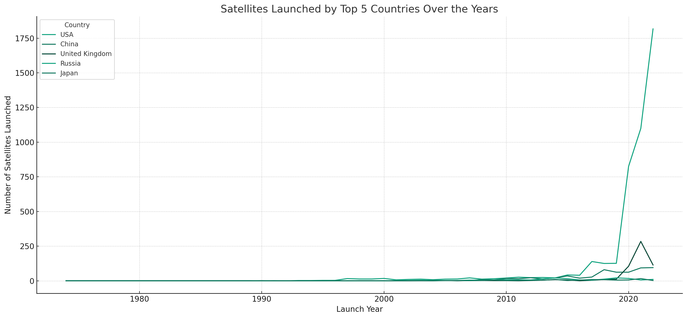
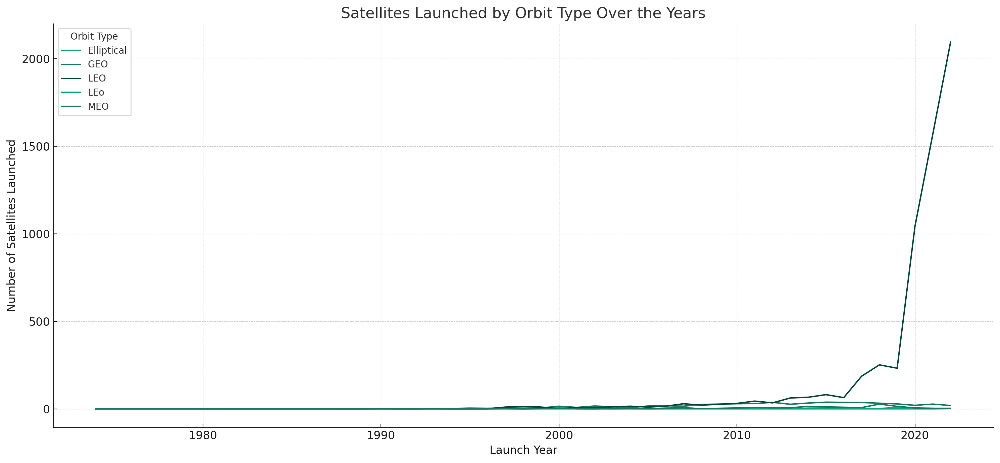
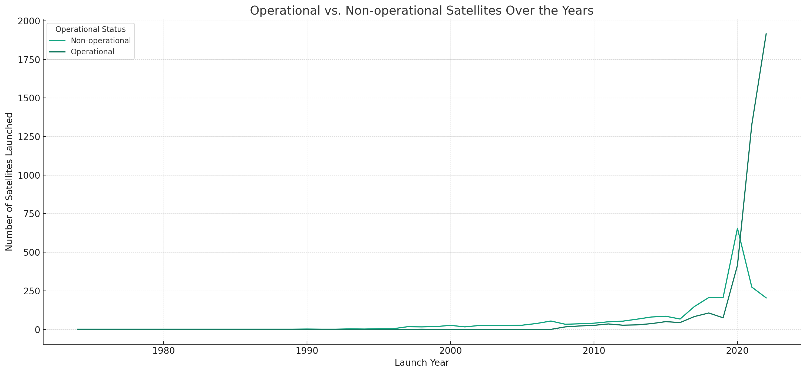
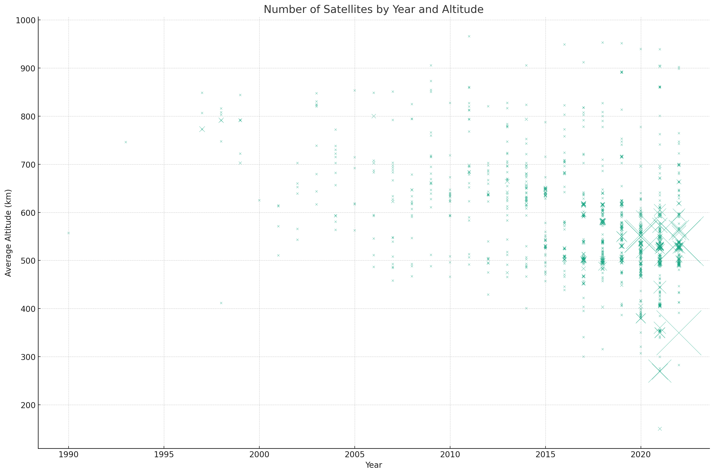
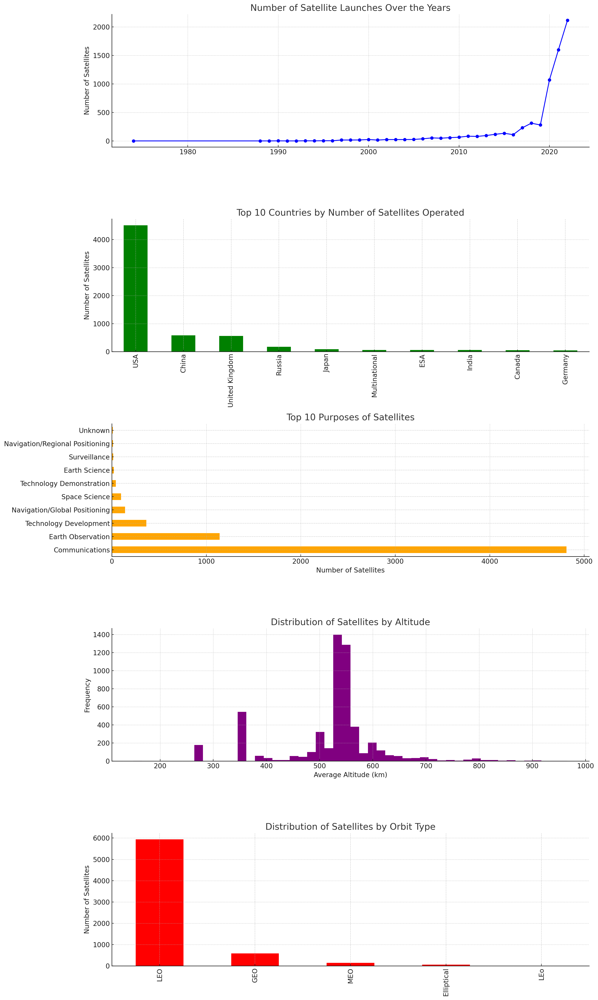
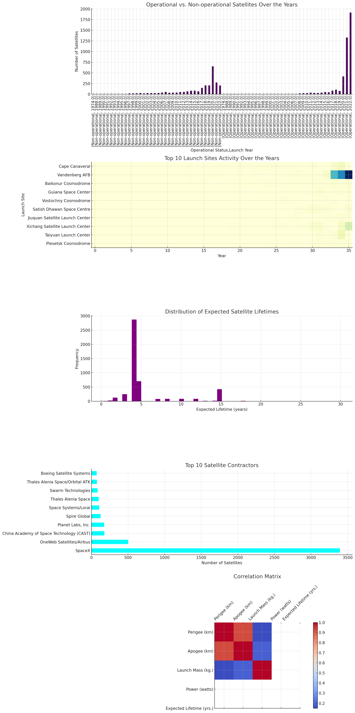

#visualize-satellites-data

This is a python script that use plot to visualize the infos on current satelltes in space. 

#How to use:
1. In plt_country_orbit_operational_mix.py: change the 'dirname= r"G:\OtherProject\visualize_satellites\ucsusa.org_sites_default_files_2023-06_UCS-Satellite-Database-1-1-2023.txt" into your dir
2. Run the plt_country_orbit_operational_mix.py.
3. View the plots.

##Result Samples: 

